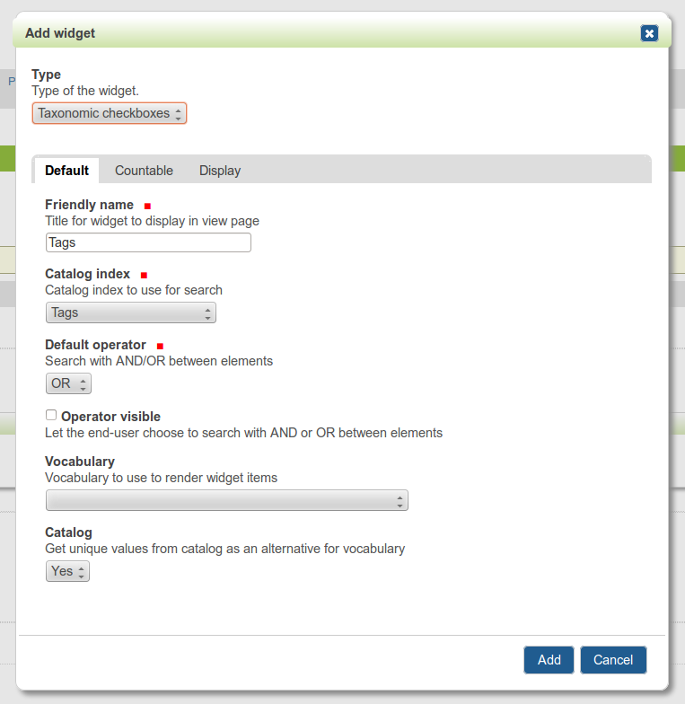

================================================
eea.facetednavigationtaxonomiccheckbox
================================================
Taxonomic tags in `EEA Faceted Navigation (eea.facetednavigation) <https://pypi.python.org/pypi/eea.facetednavigation>`_ using
`Redomino Advanced Keyword Management (redomino.advancedkeyword) <https://pypi.python.org/pypi/redomino.advancedkeyword>`_.

Usage
================================================
Filling in the tags
------------------------------------------------
Taxonomy is achieved using `redomino.advancedkeyword` package, where nesting happens
with use of dots. Example:

- Cars
- Cars.Audi
- Cars.Audi.Supermini
- Cars.Audi.Sports Car
- Cars.Audi.Full-size Crossover SUV
- Cars.Bentley
- Cars.Bentley.Flying Spur
- Cars.Bentley.Mulsanne
- Cars.Bentley.Azure
- Cars.Bentley.Rolls-Royce

Integration with your Plone site
------------------------------------------------
For installation and configuration of `eea.facetednavigation` refer to the official documentation.

In order to use the `Taxonomic Checkboxes` widget, in your "Faceted criteria" setup add the
`taxonomiccheckbox` widget with "Tags" as a "Catalog index". Your tags would be then nicely nested.

This is what you would get finally.

.. image:: _static/01_taxonomic_tags_example.png
    :align: center

Installation
================================================
Buildout
------------------------------------------------
>>> [instance]
>>> eggs +=
>>>     eea.facetednavigationtaxonomiccheckbox

>>> zcml +=
>>>     eea.facetednavigationtaxonomiccheckbox

ZMI
------------------------------------------------
ZMI -> portal_quickinstaller
~~~~~~~~~~~~~~~~~~~~~~~~~~~~~~~~~~~~~~~~~~~~~~~~
Choose "Taxonomic Checkbox widget for EEA Faceted Navigation" and install it.

Documentation
================================================
See the documentation at:

- http://eeafacetednavigationtaxonomiccheckbox.readthedocs.org/en/latest/
- http://pythonhosted.org/eea.facetednavigationtaxonomiccheckbox/

Support
================================================
For feature requests or bugs, open an issue. For questions, send us an email to info@gw20e.com.

License
================================================
GPL 2.0

Authors & copyright
================================================
Copyright (C) 2014 Goldmund, Wyldebeast & Wunderliebe.

Authors listed in alphabetic order (by name):

- Artur Barseghyan
